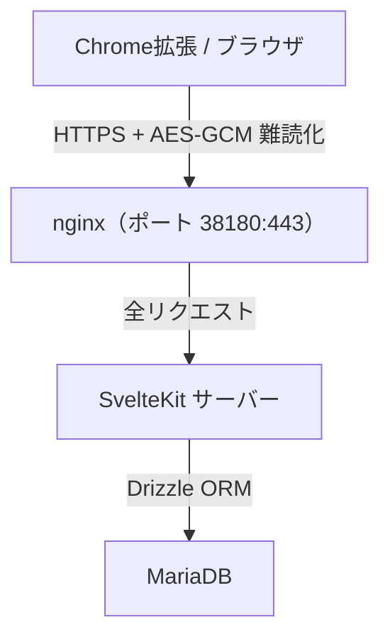
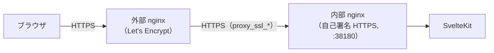
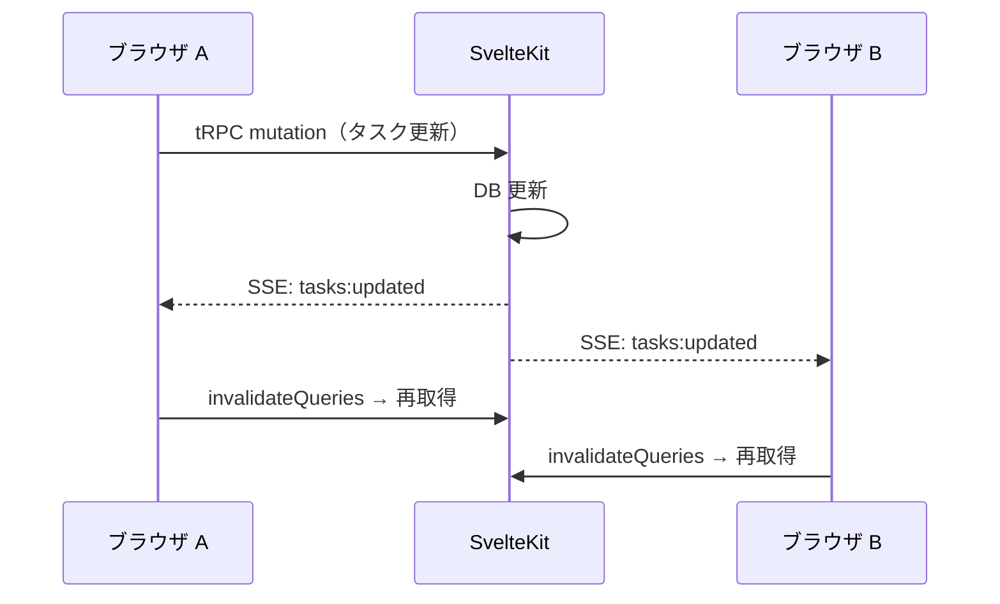

# アーキテクチャ

## スタック

| レイヤー         | 技術                  | 役割                                    |
| ---------------- | --------------------- | --------------------------------------- |
| アプリケーション | SvelteKit             | UI・ルーティング・SSR・API・DB アクセス |
| API              | tRPC v11              | 型安全な RPC（難読化ミドルウェア付き）  |
| バリデーション   | Zod                   | スキーマバリデーション                  |
| データ取得       | TanStack Svelte Query | クライアント側キャッシュ・状態管理      |
| ORM              | Drizzle ORM           | DB アクセス（型安全）                   |
| DB               | MariaDB               | データ永続化                            |
| リバースプロキシ | nginx                 | HTTPS 終端                              |
| CSS              | Tailwind CSS          | スタイリング                            |
| 難読化           | Web Crypto API        | ブラウザ ↔ SvelteKit 間 AES-GCM         |
| 認証             | JWT/HS256 (`jose`)    | Cookie セッション管理                   |

## アーキテクチャ図（Docker Compose 内部構成）



## 外部リバースプロキシ設定

Docker Composeの前段にLet's Encrypt証明書でHTTPS終端する外部nginxを配置する場合の設定要点。



設定上の制約:

- 内部nginxは自己署名HTTPSのため、`/api/events`と`/`の両方に
 `proxy_ssl_certificate` / `proxy_ssl_certificate_key`を指定する
- SSE用の`/api/events`には`proxy_buffering off`に加え`proxy_read_timeout 86400`・
 `proxy_http_version 1.1`・`Connection ''`を指定する。
  さらに`X-Accel-Buffering: no`ヘッダーでレスポンスバッファも無効化する
（SSEがバッファされると配信遅延が発生するため）

最小サンプル（要点のみ）:

```nginx
location /api/events {
    proxy_pass https://app_backend;
    proxy_http_version 1.1;
    proxy_set_header Connection '';
    proxy_ssl_certificate     /path/to/glatasks/web/ssl/server.crt;
    proxy_ssl_certificate_key /path/to/glatasks/web/ssl/server.key;
    proxy_buffering off;
    proxy_read_timeout 86400;
    add_header X-Accel-Buffering no;
}

location / {
    proxy_pass https://app_backend;
    proxy_ssl_certificate     /path/to/glatasks/web/ssl/server.crt;
    proxy_ssl_certificate_key /path/to/glatasks/web/ssl/server.key;
}
```

`Host` / `X-Forwarded-For` / `X-Forwarded-Proto`等の標準ヘッダーは通常通り設定する。

## リアルタイム同期（SSE）

mutation完了時にSSE (Server-Sent Events) で他タブ・他端末へ即座に通知する。



- エンドポイント: `GET /api/events`（Cookie認証）
- データは含めずイベント種別のみ送信（`lists:updated` / `tasks:updated` / `timers:updated`）
- クライアントはイベント受信時にTanStack Queryの `invalidateQueries` で該当データを再取得
- 再接続は`EventSource`の自動再接続に加え、クライアント側で接続の健全性を監視する。
  受信ウォッチドッグ（30秒周期で判定、最終受信から75秒経過で強制再接続）・
  `error`イベント発火時の`readyState=CLOSED`即時再接続・
  `visibilitychange`での可視復帰時の前倒し判定を組み合わせ、
  ブラウザのネットワークタイマー減速等で接続がゾンビ化した際の差分sync取りこぼしを防ぐ
- nginx: `/api/events` に `proxy_buffering off` を設定（SSEがバッファされると配信遅延が発生するため）

## タイマー時刻同期

タイマーの残り時間をブラウザで正確に計算するため、サーバーとの時刻差（オフセット）を管理する。

### オフセット計算

tRPCレスポンスでRTT/2補正付きの精密なオフセットを計算する:

```text
offset = serverTime - (requestStart + requestEnd) / 2
```

### オフセット更新の流れ

```text
SSE connected (初回接続)  ──→ setServerOffset(暫定値)
tRPC response (1分間隔)   ──→ setServerOffset(RTT/2補正値)
tRPC response (SSEイベント後) → setServerOffset(RTT/2補正値)
SSE heartbeat (30秒ごと)  ──→ 接続維持のみ（オフセット更新なし）
```

SSEは片道通信のためRTTを測定できない。heartbeatのサーバー時刻でオフセットを上書きすると、
tRPCのRTT/2補正で得た精密値が片道遅延分だけズレた値に劣化するため、heartbeatは接続維持のみに使用する。

heartbeatの送出形式には名前付きイベント（`event: heartbeat`）を採用する。
コメント行形式（`:\n\n`）では`EventSource`がイベントとして通知せず、
クライアント側の受信ウォッチドッグが`addEventListener("heartbeat", ...)`で
最終受信時刻を更新できない。

## 認証設計

CookieベースのJWT/HS256セッション。実装詳細は `hooks.server.ts` / `session.ts` を参照。

### CSRF 対策

多層防御を採用している。

- SvelteKit組み込み機能でform actionを保護
- カスタムリクエストヘッダーのオリジンチェックでtRPCエンドポイント（`/api/*`）のクロスサイトミューテーションをブロック
- ログアウトをPOSTに限定（GETリクエストによるCSRFを防止するため）

Chrome拡張のポップアップ内iframeからのアクセスを許可する必要があるため、
Cookieに `sameSite: "none"` + `secure: true` を設定している。
この設定はCSRF対策を弱めるため、上記のオリジンチェックで補完している。

## DB 設計方針

テーブル定義は `app/src/lib/server/schema.ts` を参照。以下はコードから読み取りにくい設計判断:

- 日時カラムはすべてTIMESTAMP型でUTC保存。タイムゾーン変換はクライアント側で行い、
  サーバー・DB層ではタイムゾーンを意識しない設計
- 並び順は `sort_order` INTカラム（昇順、1000刻み）。刻み幅を大きくすることで、挿入時に周囲のレコードを更新せずに済む。
  ドメインごとの挿入位置: タスク（`tasks.create`）は `sort_order = 既存最小値 - 1000` で先頭挿入、
  タイマー（`timers.create`）は `sort_order = 既存最大値 + 1000` で末尾追加
- タイマーの残り時間はサーバー側で計算せず、`remaining_seconds` と `started_at` をクライアントに渡して
  ブラウザ側で計算する。これにより秒単位のリアルタイム表示をポーリングなしで実現する
- タイマーの `ephemeral` カラムは1回限り使用するタイマーを識別するフラグ。
  作成時のみ設定でき、`adjust` / `reset` / `setTime` などの操作で変更されない。
  クライアント側では満了到達時に削除ボタンを強調し、確認ダイアログを省略して削除できる体験に用いる
