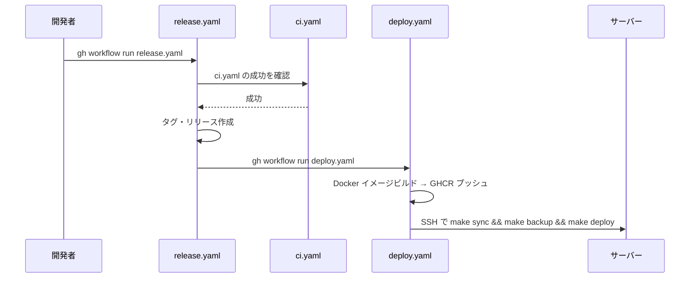

# 開発手順

## 作業ディレクトリ

すべての `make` コマンドはプロジェクトルートから実行する。

```bash
cd /path/to/glatasks
make test  # OK
```

`app/` に移動して実行すると `${PWD}` がずれてMakefile内のパス解決が誤動作するため、必ずルートから実行する。

## 開発環境の構築手順

1. 本リポジトリをcloneする
2. [uv](https://docs.astral.sh/uv/) をインストールする

   ```bash
   curl -LsSf https://astral.sh/uv/install.sh | sh
   ```

3. [pre-commit](https://pre-commit.com/)フックをインストールする

   ```bash
   uvx pre-commit install
   ```

4. 起動する

   ```bash
   make deploy
   ```

## make コマンド

`make help` で一覧を確認できる。よく使うコマンド:

- `make format` — コード編集後に実行。整形 + 自動修正付きlint
- `make test` — コミット前に実行。pre-commit + pyfltr（lint・型チェック・ユニットテスト・svelte-check一括実行）+
  バックアップテスト + e2eの全検証
- `make deploy` — ビルド → 停止 → 起動

svelte-checkはpyfltrの`custom-commands`機能で統合されているため、`uvx pyfltr run`から自動実行される。
`pyproject.toml`の`[tool.pyfltr.custom-commands.svelte-check]`で設定している。

## ツールチェイン

- Prettier, prettier-plugin-svelte, prettier-plugin-tailwindcss: コード整形
- ESLint: typescript-eslint, eslint-plugin-svelte

Biome移行における主要な阻害要因は以下のとおり。

1. Svelteマークアップ非対応 — Biomeは `.svelte` のマークアップ部分のフォーマットに対応していない。
   現在はprettier-plugin-svelteが全体を統一的に処理している
2. Tailwind CSSクラスソート非対応 — prettier-plugin-tailwindcssに相当する機能がBiomeに存在しない。
   当該機能はプロジェクト全体で使用している

## Docker 構成

サービス構成・環境変数は `compose.yaml` / `.env` を参照。

## 開発環境での動作確認

開発環境はすべてDocker Compose上で動作する。ホストから直接 `localhost:3000` にアクセスできない場合がある。

nginx経由で確認:

```bash
curl -k https://localhost:38180/healthcheck
```

appコンテナ経由で確認:

```bash
docker compose exec app curl --fail http://localhost:3000/healthcheck
```

`make healthcheck` はホスト直接→コンテナ経由の順にフォールバックして確認する。

## ユニットテスト

Vitestを使ったユニットテストは `make node-shell` でコンテナに入り、`pnpm exec vitest run` で実行できる。

```bash
make node-shell
pnpm exec vitest run
```

`make test` を実行すると型チェック + ユニットテスト + e2eがまとめて実行される（lintは `make format` で実行済み）。

テストコードは `app/src/` 配下に `*.test.ts` として配置する（例: `app/src/lib/crypto.test.ts`）。

## e2e テスト

Playwrightを使ったe2eテストを `make test-e2e` で実行できる。

```bash
make test-e2e
```

テストコードは `app/tests/` に配置する。
nginx経由のHTTPS（port 38180）でテストするため、開発環境が起動している必要がある。
テストユーザーは `app/tests/global-setup.ts` で初回自動作成される。

### Playwright テスト実装の注意点

- SvelteKitのhydration完了を待つ: `waitForSelector` はSSRで描画されるため即返るが、
  `onMount` のAPI呼び出しはまだ完了していない。SSE接続が常時開いているため `waitUntil: "networkidle"` は使えない。
  `Promise.all([page.goto(url), page.waitForResponse(res => res.url().includes("/api/trpc"))])` パターンを使うこと。
- `browser.newContext()` を使う場合は `baseURL` を明示する: `page.goto("/")` が動くよう `baseURL` を指定すること。
- セレクタの曖昧さに注意: `button:has-text("追加")` はサイドバーのリスト追加ボタンにも一致する。
  `main button:has-text("追加")` のようにスコープを限定すること。
- 複数ブラウザ（多端末同期）のテスト: `browser.newContext(...)` を2つ作り、終了時に `finally` で `ctx.close()` する。
  引数には `storageState` / `ignoreHTTPSErrors` / `baseURL` を指定する。
  値は `app/tests/.auth/user.json` / `true` / `process.env.BASE_URL ?? "https://localhost:38180"` とする。
- SSEイベントを受信しない状態を再現する: `await ctx.route("**/api/events", route => route.abort())`
  でSSEエンドポイントへの接続だけを遮断できる。`/api/trpc` は通るので削除等の通常操作は引き続き実行できる。

### テスト設計の思想

`make format` と `make test` の2パターンを基本とする。

- `make format`: 軽量な整形 + lint。コード編集後に日常的に実行する用途。
  pre-commit hooks（prettier, eslint --fix, markdownlint, textlint）+ `pyfltr fast`を実行
- `make test`: 全テスト。コミット前に実行する用途。
  pre-commit → `pyfltr run`（lint・型チェック・ユニットテスト・svelte-check）→ バックアップテスト → e2eテスト
- CI（ci.yaml）: `test` jobで`pyfltr ci`を実行する。
  `integration` jobでDocker Composeを起動してバックアップテストとe2eテストを実行する

## 開発時の注意点

- JSONボディから受け取る数値は文字列の場合があるため `Number()` で明示変換すること（`"5" !== 5` の型不一致を防ぐ）
- 日時は全レイヤーでUTC統一。DB（TIMESTAMP型）→ サーバー（Dateオブジェクト）→ クライアント（ISO8601文字列）の
  変換は自動で行われるため、タイムゾーンを意識するコードは不要

## サプライチェーン攻撃対策

npm / PyPIレジストリへの悪意あるパッケージ公開に対する防御として、
公開から一定期間が経過したパッケージのみインストールを許可する設定を導入している。

### pnpm: minimumReleaseAge

`pnpm-workspace.yaml` に `minimumReleaseAge: 1440`（1日 = 1440分）を設定。
npmレジストリに公開されてから1日未満のバージョンはインストールされない。`pnpm dlx`（pnpx）にも適用される（pnpm 10.18以降）。

`docs/` はpnpm workspacesでルートと統合管理しているため、`pnpm-workspace.yaml` の設定が自動的に適用される。

緊急でリリース直後のパッケージが必要な場合は `pnpm-workspace.yaml` に一時的に追加する:

```yaml
minimumReleaseAgeExclude:
  - package-name@1.2.3
```

### uv: exclude-newer

`uv.toml` に `exclude-newer = "1 day"` を設定。PyPIに公開されてから1日未満のパッケージはインストールされない。
`uvx`（`uv tool run`）にも適用される。

### pre-commit のバージョン固定

`.pre-commit-config.yaml` の `additional_dependencies` で指定するnpmパッケージ（textlint等）は
pre-commitが直接npm経由でインストールする。そのためpnpmの `minimumReleaseAge` は適用されない。
代わりに `@latest` ではなくバージョンを固定している。

### pnpmにおけるlockfile尊重

サプライチェーン攻撃対策の二重防御として、CI・Docker・`make`から呼ばれる`pnpm install`は
すべて`--frozen-lockfile`を明示している。
これにより`pnpm-lock.yaml`が`package.json`と乖離している場合に再resolveを許さずインストールを失敗させ、
ロックファイルが意図せず書き換わるリスクを抑えている。

- `Dockerfile`のビルドステージ
- `compose.yaml` / `compose.development.yaml`のアプリ起動コマンド
- `Makefile`の`RUN_NODE`関数および`test-e2e`ターゲット
- `.github/workflows/ci.yaml` / `.github/workflows/docs.yaml`のCIステップ

依存を更新するときは`make update`から呼ばれる`pnpm update --latest`を使う。
`pnpm update`は`--frozen-lockfile`の影響を受けないため、開発フローを阻害しない。

## CI/CD

### CI（ci.yaml）

masterへのpush・PR時に自動実行する。以下の2つのjobを並列に走らせる。

- `test` job: `pnpm install` → `pnpm run build` → `pyfltr ci`。
  lint・型チェック・ユニットテスト・svelte-checkをpyfltr経由で一括実行する
- `integration` job: 以下の流れでDocker Composeを起動してバックアップテストとe2eテストを実行する
  1. ランナー上に`.env`を生成する
  1. `docker build`でproductionイメージをローカルビルドする
  1. `docker compose --profile production up -d --wait`でスタックを起動する
  1. `make test-backup`でバックアップテストを実行する
  1. `docker compose --profile production --profile ci run playwright ...`でe2eテストを実行する
  1. 失敗時は`test-results` / `playwright-report`を`actions/upload-artifact`で保存する

`integration` jobはDocker Compose環境が必要なため`test` jobと分離している。
同一ワークフロー内で実行することでmaster push / PRの両方で回帰検出ができる。
`compose.yaml`の`playwright`サービスには`ci`プロファイルを追加しており、
production相当のスタックにplaywrightサービスだけ追加で起動する構成にしている。

### リリース→デプロイの流れ



1. `release.yaml`（手動実行）: masterのci.yamlが成功していることを確認 → バージョンタグとリリースを作成 →
   `gh workflow run deploy.yaml` でデプロイを起動
2. `deploy.yaml`（release.yamlから起動）: DockerイメージをビルドしてGHCRにプッシュ →
   SSHでサーバーに接続し `make sync && make backup && make deploy` を実行

## GitHub Actionsのデプロイ用SSHキー作成手順

鍵ペアを作成、サーバーに登録:

```bash
ssh-keygen -t ed25519 -C "github-action@GLATasks" -f github_action
ssh-copy-id -i github_action.pub ubuntu@aws.tqzh.tk
```

GitHubに秘密鍵を登録:

- リポジトリ → Settings → Secrets and variables → Actions → New repository secret
  - Name: `SSH_PRIVATE_KEY`
  - Value: `cat github_action` の出力

後始末:

```bash
\rm github_action github_action.pub
```

## バックアップとリストア

### バックアップ

デプロイ前にDBダンプとキーファイルのバックアップを取得する。CIデプロイ（deploy.yaml）では `make deploy` の前に自動実行される。

```bash
make backup
```

バックアップ先: `${DATA_DIR}/backups/YYYYMMDD_HHMMSS/`（DBダンプ + キーファイル）

デフォルトで直近5世代を保持する。`BACKUP_KEEP` 環境変数で変更可能:

```bash
BACKUP_KEEP=10 make backup
```

DBコンテナが停止中の場合はエラー終了する。初回デプロイなどDBがない状態では `SKIP_DB_DUMP=1` でスキップ可能:

```bash
SKIP_DB_DUMP=1 make backup
```

### リストア

```bash
# DB 復元
docker compose exec -T db mariadb -uglatasks -pglatasks glatasks < ${DATA_DIR}/backups/YYYYMMDD_HHMMSS/glatasks.sql

# キーファイル復元
cp -p ${DATA_DIR}/backups/YYYYMMDD_HHMMSS/.encrypt_key ${DATA_DIR}/
cp -p ${DATA_DIR}/backups/YYYYMMDD_HHMMSS/.secret_key ${DATA_DIR}/

# app 再起動（キーファイルを反映）
make restart-app
```

## ドキュメントサイト

[VitePress](https://vitepress.dev/) を使用。
`docs/` ディレクトリ直下のMarkdownファイルがページ、`docs/.vitepress/config.ts` でサイト設定を管理する。

### ローカルプレビュー

```bash
make docs
```

`http://localhost:5173/GLATasks/` でプレビューできる。

### デプロイ

masterへのpush時に `docs/` 配下の変更があれば `docs.yaml` ワークフローが自動実行され、GitHub Pagesにデプロイされる。

### GitHub Pages の初期設定

GitHub PagesのソースをGitHub Actionsに設定する:

```bash
gh api repos/ak110/GLATasks/pages -X POST -f build_type=workflow
```

## リリース手順

事前に`gh`コマンドをインストールして`gh auth login`でログインしておき、以下のコマンドのいずれかを実行。

```bash
gh workflow run release.yaml --field="bump=PATCH"
gh workflow run release.yaml --field="bump=MINOR"
gh workflow run release.yaml --field="bump=MAJOR"
```

<https://github.com/ak110/GLATasks/actions> で状況を確認できる。

リリース作成後、deploy.yamlが自動的にトリガーされ本番デプロイが実行される。詳細は [CI/CD](#cicd) セクションを参照。
